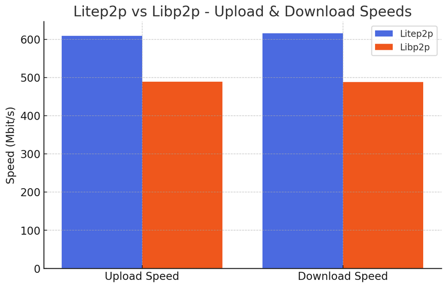

# Litep2p Performance Protocol

The Litep2p Performance Protocol measures upload and download times between multiple Litep2p instances.
The `/noise` and `/yamux` protocols are negotiated automatically.

## Performance Measurements

### Bandwidth

This data showcases upload and download speeds for high-throughput performance across different communication configurations using Litep2p and Libp2p.



Here are some key insights:

- litep2p setup is **~24% faster** for upload speeds, and **~26% faster** for download speeds than libp2p
  - litep2p -> litep2p is the the fasted across all cases
    - top upload bandwidth is `608.78 Mbit/s`  (512MiB), while download is `615.73 Mbit/s` (32MiB)
  - libp2p -> libp2p is aproximately ~100 Mbit/s slower
    - top upload bandwidth is `488.77 Mbit/s` (256MiB), while download is `488.18 Mbit/s` (256MiB)

| Operation  | Bytes      | Litep2p->Litep2p | Libp2p->Libp2p | Libp2p->Litep2p | Litep2p->Libp2p |
|------------|------------|------------------|----------------|-----------------|-----------------|
| Uploaded   | 16MiB | 588.77 Mbit/s | 486.59 Mbit/s | 508.14 Mbit/s | 534.24 Mbit/s |
| Uploaded   | 32MiB | 608.04 Mbit/s | 454.59 Mbit/s | 512.72 Mbit/s | 543.04 Mbit/s |
| Uploaded   | 64MiB | 596.67 Mbit/s | 476.27 Mbit/s | 512.60 Mbit/s | 539.67 Mbit/s |
| Uploaded   | 128MiB | 597.67 Mbit/s | 475.44 Mbit/s | 500.52 Mbit/s | 566.77 Mbit/s |
| Uploaded   | 256MiB | 568.63 Mbit/s | 488.77 Mbit/s | 503.91 Mbit/s | 523.64 Mbit/s |
| Uploaded   | 512MiB | 608.78 Mbit/s | 485.44 Mbit/s | 518.24 Mbit/s | 585.06 Mbit/s |
| Uploaded   | 1,0GiB | 593.76 Mbit/s | 480.22 Mbit/s | 509.59 Mbit/s | 533.81 Mbit/s |
| Downloaded | 16MiB | 601.63 Mbit/s | 480.64 Mbit/s | 543.31 Mbit/s | 500.06 Mbit/s |
| Downloaded | 32MiB | 615.73 Mbit/s | 486.40 Mbit/s | 533.18 Mbit/s | 499.05 Mbit/s |
| Downloaded | 64MiB | 609.44 Mbit/s | 485.17 Mbit/s | 557.61 Mbit/s | 505.44 Mbit/s |
| Downloaded | 128MiB | 603.49 Mbit/s | 483.54 Mbit/s | 541.33 Mbit/s | 495.37 Mbit/s |
| Downloaded | 256MiB | 600.82 Mbit/s | 488.18 Mbit/s | 564.84 Mbit/s | 497.95 Mbit/s |
| Downloaded | 512MiB | 506.49 Mbit/s | 483.55 Mbit/s | 519.57 Mbit/s | 498.65 Mbit/s |
| Downloaded | 1,0GiB | 601.71 Mbit/s | 485.35 Mbit/s | 543.15 Mbit/s | 500.86 Mbit/s |

_Check the appendix for the full bandwidth data._

### Yamux Substreams

| Substreams | Average Time to Open Substreams Litep2p |
|------------|--------------------------------|
| 1        | 528.738µs |
| 32        | 2.418918ms |
| 64        | 3.993045ms |
| 128        | 8.424956ms |
| 256        | 11.428443ms |

## Protocol Specification

The protocol identifier is `/litep2p-perf/1.0.0`, and it operates in two modes, client and server.

### Client Mode

1. Connects to the server.
2. Sends a u64 big-endian value indicating the number of bytes to upload.
3. Uploads the specified number of bytes.
4. Sends a u64 big-endian value indicating the number of bytes to download.
5. Downloads the specified number of bytes.

### Server Mode

1. Listens for client connections.
2. Reads a u64 big-endian value specifying the expected upload size.
3. Receives the specified number of bytes.
4. Reads a u64 big-endian value specifying the expected download size.
5. Sends the specified number of bytes to the client.


## Network Bandwidth

### Scripted

```bash
./run_bandwidth.sh
```

### Server

```bash
RUST_LOG=info cargo run -- server --listen-address "/ip6/::/tcp/33333" --node-key "secret"
```

### Client

```bash
RUST_LOG=info cargo run -- client --server-address "/ip6/::1/tcp/33333/p2p/12D3KooWBpZHDZu7YSbvPaPXKhkRNJvR7MkTJMQQAVBKx9mCqz3q" --upload-bytes 1024 --download-bytes 0
```

## Time to Open Substreams

### Server

```bash
RUST_LOG=info cargo run -- server --listen-address "/ip6/::/tcp/33333" --node-key "secret"
```

### Client

```bash
RUST_LOG=info cargo run -- client-substream --server-address "/ip6/::1/tcp/33333/p2p/12D3KooWBpZHDZu7YSbvPaPXKhkRNJvR7MkTJMQQAVBKx9mCqz3q" --substreams 32
```

### Scripted

```bash
cd litep2p
./run_substreams.sh
```

## Appendix

### Bandwidth

| Operation  | Bytes      | Litep2p->Litep2p | Libp2p->Libp2p | Libp2p->Litep2p | Litep2p->Libp2p |
|------------|------------|------------------|----------------|-----------------|-----------------|
| Uploaded   | 1,0KiB | 3.77 Gbit/s | 4.35 Gbit/s | 4.56 Gbit/s | 3.61 Gbit/s |
| Uploaded   | 2,0KiB | 3.11 Gbit/s | 2.67 Gbit/s | 2.75 Gbit/s | 2.48 Gbit/s |
| Uploaded   | 4,0KiB | 4.23 Gbit/s | 4.88 Gbit/s | 7.02 Gbit/s | 5.14 Gbit/s |
| Uploaded   | 8,0KiB | 4.45 Gbit/s | 6.13 Gbit/s | 6.03 Gbit/s | 5.58 Gbit/s |
| Uploaded   | 16KiB | 502.09 Mbit/s | 515.68 Mbit/s | 510.01 Mbit/s | 443.20 Mbit/s |
| Uploaded   | 32KiB | 645.81 Mbit/s | 661.01 Mbit/s | 549.09 Mbit/s | 634.26 Mbit/s |
| Uploaded   | 64KiB | 573.64 Mbit/s | 559.63 Mbit/s | 570.35 Mbit/s | 382.15 Mbit/s |
| Uploaded   | 128KiB | 544.27 Mbit/s | 485.29 Mbit/s | 284.80 Mbit/s | 588.11 Mbit/s |
| Uploaded   | 256KiB | 548.08 Mbit/s | 495.29 Mbit/s | 168.58 Mbit/s | 547.41 Mbit/s |
| Uploaded   | 512KiB | 559.30 Mbit/s | 495.63 Mbit/s | 516.49 Mbit/s | 558.62 Mbit/s |
| Uploaded   | 1,0MiB | 549.48 Mbit/s | 502.00 Mbit/s | 509.12 Mbit/s | 574.06 Mbit/s |
| Uploaded   | 2,0MiB | 544.65 Mbit/s | 458.79 Mbit/s | 512.94 Mbit/s | 552.43 Mbit/s |
| Uploaded   | 4,0MiB | 585.49 Mbit/s | 489.34 Mbit/s | 508.92 Mbit/s | 556.91 Mbit/s |
| Uploaded   | 8,0MiB | 590.55 Mbit/s | 477.83 Mbit/s | 511.24 Mbit/s | 537.80 Mbit/s |
| Uploaded   | 16MiB | 588.77 Mbit/s | 486.59 Mbit/s | 508.14 Mbit/s | 534.24 Mbit/s |
| Uploaded   | 32MiB | 608.04 Mbit/s | 454.59 Mbit/s | 512.72 Mbit/s | 543.04 Mbit/s |
| Uploaded   | 64MiB | 596.67 Mbit/s | 476.27 Mbit/s | 512.60 Mbit/s | 539.67 Mbit/s |
| Uploaded   | 128MiB | 597.67 Mbit/s | 475.44 Mbit/s | 500.52 Mbit/s | 566.77 Mbit/s |
| Uploaded   | 256MiB | 568.63 Mbit/s | 488.77 Mbit/s | 503.91 Mbit/s | 523.64 Mbit/s |
| Uploaded   | 512MiB | 608.78 Mbit/s | 485.44 Mbit/s | 518.24 Mbit/s | 585.06 Mbit/s |
| Uploaded   | 1,0GiB | 593.76 Mbit/s | 480.22 Mbit/s | 509.59 Mbit/s | 533.81 Mbit/s |
| Downloaded | 1,0KiB | 37.52 Mbit/s | 32.47 Mbit/s | 27.34 Mbit/s | 32.32 Mbit/s |
| Downloaded | 2,0KiB | 59.92 Mbit/s | 70.58 Mbit/s | 67.25 Mbit/s | 56.54 Mbit/s |
| Downloaded | 4,0KiB | 104.13 Mbit/s | 107.57 Mbit/s | 62.26 Mbit/s | 103.77 Mbit/s |
| Downloaded | 8,0KiB | 144.40 Mbit/s | 164.40 Mbit/s | 144.31 Mbit/s | 175.94 Mbit/s |
| Downloaded | 16KiB | 226.44 Mbit/s | 244.50 Mbit/s | 234.40 Mbit/s | 192.15 Mbit/s |
| Downloaded | 32KiB | 433.87 Mbit/s | 246.87 Mbit/s | 302.03 Mbit/s | 398.61 Mbit/s |
| Downloaded | 64KiB | 398.39 Mbit/s | 391.43 Mbit/s | 319.19 Mbit/s | 348.72 Mbit/s |
| Downloaded | 128KiB | 399.92 Mbit/s | 438.45 Mbit/s | 345.96 Mbit/s | 428.56 Mbit/s |
| Downloaded | 256KiB | 553.59 Mbit/s | 417.66 Mbit/s | 355.77 Mbit/s | 475.05 Mbit/s |
| Downloaded | 512KiB | 564.92 Mbit/s | 430.31 Mbit/s | 534.81 Mbit/s | 397.76 Mbit/s |
| Downloaded | 1,0MiB | 576.16 Mbit/s | 421.55 Mbit/s | 549.70 Mbit/s | 414.19 Mbit/s |
| Downloaded | 2,0MiB | 591.18 Mbit/s | 485.44 Mbit/s | 569.70 Mbit/s | 459.81 Mbit/s |
| Downloaded | 4,0MiB | 585.57 Mbit/s | 428.47 Mbit/s | 490.32 Mbit/s | 502.02 Mbit/s |
| Downloaded | 8,0MiB | 609.17 Mbit/s | 490.68 Mbit/s | 522.76 Mbit/s | 496.34 Mbit/s |
| Downloaded | 16MiB | 601.63 Mbit/s | 480.64 Mbit/s | 543.31 Mbit/s | 500.06 Mbit/s |
| Downloaded | 32MiB | 615.73 Mbit/s | 486.40 Mbit/s | 533.18 Mbit/s | 499.05 Mbit/s |
| Downloaded | 64MiB | 609.44 Mbit/s | 485.17 Mbit/s | 557.61 Mbit/s | 505.44 Mbit/s |
| Downloaded | 128MiB | 603.49 Mbit/s | 483.54 Mbit/s | 541.33 Mbit/s | 495.37 Mbit/s |
| Downloaded | 256MiB | 600.82 Mbit/s | 488.18 Mbit/s | 564.84 Mbit/s | 497.95 Mbit/s |
| Downloaded | 512MiB | 506.49 Mbit/s | 483.55 Mbit/s | 519.57 Mbit/s | 498.65 Mbit/s |
| Downloaded | 1,0GiB | 601.71 Mbit/s | 485.35 Mbit/s | 543.15 Mbit/s | 500.86 Mbit/s |