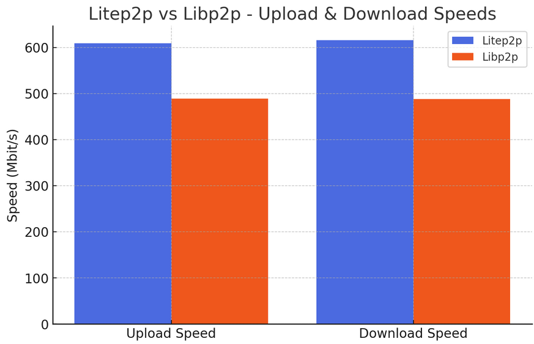

# Litep2p Performance Protocol

The Litep2p Performance Protocol measures upload and download times between multiple Litep2p instances.
The `/noise` and `/yamux` protocols are negotiated automatically.

## Performance Measurements

### Bandwidth

This data showcases upload and download speeds for high-throughput performance across different communication configurations using Litep2p and Libp2p.



Here are some key insights:

- litep2p setup is **~24% faster** for upload speeds, and **~26% faster** for download speeds than libp2p
  - litep2p -> litep2p is the the fasted across all cases
    - top upload bandwidth is `608.78 Mbit/s`  (512MiB), while download is `615.73 Mbit/s` (32MiB)
  - libp2p -> libp2p is aproximately ~100 Mbit/s slower
    - top upload bandwidth is `488.77 Mbit/s` (256MiB), while download is `488.18 Mbit/s` (256MiB)

| Operation  | Bytes      | Litep2p->Litep2p | Libp2p->Libp2p | Libp2p->Litep2p | Litep2p->Libp2p |
|------------|------------|------------------|----------------|-----------------|-----------------|
| Uploaded   | 16MiB | 588.77 Mbit/s | 486.59 Mbit/s | 508.14 Mbit/s | 534.24 Mbit/s |
| Uploaded   | 32MiB | 608.04 Mbit/s | 454.59 Mbit/s | 512.72 Mbit/s | 543.04 Mbit/s |
| Uploaded   | 64MiB | 596.67 Mbit/s | 476.27 Mbit/s | 512.60 Mbit/s | 539.67 Mbit/s |
| Uploaded   | 128MiB | 597.67 Mbit/s | 475.44 Mbit/s | 500.52 Mbit/s | 566.77 Mbit/s |
| Uploaded   | 256MiB | 568.63 Mbit/s | 488.77 Mbit/s | 503.91 Mbit/s | 523.64 Mbit/s |
| Uploaded   | 512MiB | 608.78 Mbit/s | 485.44 Mbit/s | 518.24 Mbit/s | 585.06 Mbit/s |
| Uploaded   | 1,0GiB | 593.76 Mbit/s | 480.22 Mbit/s | 509.59 Mbit/s | 533.81 Mbit/s |
| Downloaded | 16MiB | 601.63 Mbit/s | 480.64 Mbit/s | 543.31 Mbit/s | 500.06 Mbit/s |
| Downloaded | 32MiB | 615.73 Mbit/s | 486.40 Mbit/s | 533.18 Mbit/s | 499.05 Mbit/s |
| Downloaded | 64MiB | 609.44 Mbit/s | 485.17 Mbit/s | 557.61 Mbit/s | 505.44 Mbit/s |
| Downloaded | 128MiB | 603.49 Mbit/s | 483.54 Mbit/s | 541.33 Mbit/s | 495.37 Mbit/s |
| Downloaded | 256MiB | 600.82 Mbit/s | 488.18 Mbit/s | 564.84 Mbit/s | 497.95 Mbit/s |
| Downloaded | 512MiB | 506.49 Mbit/s | 483.55 Mbit/s | 519.57 Mbit/s | 498.65 Mbit/s |
| Downloaded | 1,0GiB | 601.71 Mbit/s | 485.35 Mbit/s | 543.15 Mbit/s | 500.86 Mbit/s |

_Check the appendix for the full bandwidth data._

### Yamux Substreams

| Substreams | Average Time to Open Substreams Litep2p |
|------------|--------------------------------|
| 1        | 528.738µs |
| 32        | 2.418918ms |
| 64        | 3.993045ms |
| 128        | 8.424956ms |
| 256        | 11.428443ms |

## Protocol Specification

The protocol identifier is `/litep2p-perf/1.0.0`, and it operates in two modes, client and server.

### Client Mode

1. Connects to the server.
2. Sends a u64 big-endian value indicating the number of bytes to upload.
3. Uploads the specified number of bytes.
4. Sends a u64 big-endian value indicating the number of bytes to download.
5. Downloads the specified number of bytes.

### Server Mode

1. Listens for client connections.
2. Reads a u64 big-endian value specifying the expected upload size.
3. Receives the specified number of bytes.
4. Reads a u64 big-endian value specifying the expected download size.
5. Sends the specified number of bytes to the client.


## Network Bandwidth

### Scripted

```bash
./run_bandwidth.sh
```

### Server

```bash
RUST_LOG=info cargo run -- server --listen-address "/ip6/::/tcp/33333" --node-key "secret"
```

### Client

```bash
RUST_LOG=info cargo run -- client --server-address "/ip6/::1/tcp/33333/p2p/12D3KooWBpZHDZu7YSbvPaPXKhkRNJvR7MkTJMQQAVBKx9mCqz3q" --upload-bytes 1024 --download-bytes 0
```

## Time to Open Substreams

### Server

```bash
RUST_LOG=info cargo run -- server --listen-address "/ip6/::/tcp/33333" --node-key "secret"
```

### Client

```bash
RUST_LOG=info cargo run -- client-substream --server-address "/ip6/::1/tcp/33333/p2p/12D3KooWBpZHDZu7YSbvPaPXKhkRNJvR7MkTJMQQAVBKx9mCqz3q" --substreams 32
```

### Scripted

```bash
cd litep2p
./run_substreams.sh
```

## Appendix

### Bandwidth

| Operation  | Bytes  | Litep2p->Litep2p (TCP) | Libp2p->Libp2p (TCP) | Libp2p->Libp2p (WebRTC) | Libp2p->Litep2p (TCP) | Libp2p->Litep2p (WebRTC) | Litep2p->Libp2p (TCP) |
|------------|--------|------------------------|----------------------|-------------------------|-----------------------|--------------------------|-----------------------|
| Uploaded   | 1.0KiB | 3.98 Gbit/s            | 2.35 Gbit/s          | 563.06 Mbit/s           | 3.39 Gbit/s           | 452.90 Mbit/s            | 3.81 Gbit/s           |
| Uploaded   | 2.0KiB | 5.91 Gbit/s            | 3.70 Gbit/s          | 1.24 Gbit/s             | 4.88 Gbit/s           | 539.56 Mbit/s            | 6.54 Gbit/s           |
| Uploaded   | 4.0KiB | 4.73 Gbit/s            | 2.81 Gbit/s          | 1.95 Gbit/s             | 6.05 Gbit/s           | 641.58 Mbit/s            | 4.73 Gbit/s           |
| Uploaded   | 8.0KiB | 10.10 Gbit/s           | 3.65 Gbit/s          | 2.27 Gbit/s             | 3.71 Gbit/s           | 354.69 Mbit/s            | 9.70 Gbit/s           |
| Uploaded   | 16KiB  | 1001.33 Mbit/s         | 409.11 Mbit/s        | 1.62 Gbit/s             | 425.71 Mbit/s         | 784.52 Mbit/s            | 647.39 Mbit/s         |
| Uploaded   | 32KiB  | 734.21 Mbit/s          | 323.24 Mbit/s        | 1.92 Gbit/s             | 329.58 Mbit/s         | 696.38 Mbit/s            | 521.65 Mbit/s         |
| Uploaded   | 64KiB  | 426.85 Mbit/s          | 417.23 Mbit/s        | 1.89 Gbit/s             | 404.08 Mbit/s         | 804.18 Mbit/s            | 465.50 Mbit/s         |
| Uploaded   | 128KiB | 385.00 Mbit/s          | 388.95 Mbit/s        | 2.06 Gbit/s             | 360.21 Mbit/s         | 673.44 Mbit/s            | 408.18 Mbit/s         |
| Uploaded   | 256KiB | 379.18 Mbit/s          | 392.68 Mbit/s        | 83.72 Mbit/s            | 505.00 Mbit/s         | 49.55 Mbit/s             | 395.67 Mbit/s         |
| Uploaded   | 512KiB | 476.20 Mbit/s          | 411.87 Mbit/s        | 43.52 Mbit/s            | 531.37 Mbit/s         | 41.83 Mbit/s             | 419.62 Mbit/s         |
| Uploaded   | 1.0MiB | 465.22 Mbit/s          | 426.62 Mbit/s        | 40.60 Mbit/s            | 410.64 Mbit/s         | 36.77 Mbit/s             | 470.99 Mbit/s         |
| Uploaded   | 2.0MiB | 518.01 Mbit/s          | 501.62 Mbit/s        | 35.07 Mbit/s            | 472.82 Mbit/s         | 33.27 Mbit/s             | 503.70 Mbit/s         |
| Uploaded   | 4.0MiB | 680.79 Mbit/s          | 587.54 Mbit/s        | 33.75 Mbit/s            | 587.76 Mbit/s         | 33.46 Mbit/s             | 673.93 Mbit/s         |
| Uploaded   | 8.0MiB | 802.99 Mbit/s          | 650.43 Mbit/s        | 32.92 Mbit/s            | 650.16 Mbit/s         | 33.60 Mbit/s             | 768.98 Mbit/s         |
| Uploaded   | 16MiB  | 854.45 Mbit/s          | 703.67 Mbit/s        | 32.99 Mbit/s            | 685.35 Mbit/s         | 33.76 Mbit/s             | 787.97 Mbit/s         |
| Uploaded   | 32MiB  | 921.60 Mbit/s          | 708.99 Mbit/s        | 32.72 Mbit/s            | 728.34 Mbit/s         | 33.68 Mbit/s             | 818.49 Mbit/s         |
| Uploaded   | 64MiB  | 957.68 Mbit/s          | 710.41 Mbit/s        | 32.42 Mbit/s            | 730.43 Mbit/s         | 33.61 Mbit/s             | 836.55 Mbit/s         |
| Uploaded   | 128MiB | 961.15 Mbit/s          | 717.94 Mbit/s        | 32.29 Mbit/s            | 749.60 Mbit/s         | 33.55 Mbit/s             | 852.71 Mbit/s         |
| Uploaded   | 256MiB | 882.12 Mbit/s          | 719.77 Mbit/s        | 32.23 Mbit/s            | 761.55 Mbit/s         | 33.48 Mbit/s             | 858.93 Mbit/s         |
| Uploaded   | 512MiB | 920.68 Mbit/s          | 716.89 Mbit/s        | 32.17 Mbit/s            | 763.27 Mbit/s         | 33.46 Mbit/s             | 860.74 Mbit/s         |
| Uploaded   | 1.0GiB | 985.91 Mbit/s          | 712.41 Mbit/s        | 32.37 Mbit/s            | 766.33 Mbit/s         | n/a                      | 868.62 Mbit/s         |
| Downloaded | 1.0KiB | 30.64 Mbit/s           | 36.34 Mbit/s         | 4.15 Mbit/s             | 29.32 Mbit/s          | 3.03 Mbit/s              | 27.98 Mbit/s          |
| Downloaded | 2.0KiB | 49.42 Mbit/s           | 44.87 Mbit/s         | 7.21 Mbit/s             | 56.93 Mbit/s          | 3.08 Mbit/s              | 45.70 Mbit/s          |
| Downloaded | 4.0KiB | 73.04 Mbit/s           | 81.47 Mbit/s         | 9.29 Mbit/s             | 86.36 Mbit/s          | 3.93 Mbit/s              | 88.12 Mbit/s          |
| Downloaded | 8.0KiB | 112.38 Mbit/s          | 119.77 Mbit/s        | 9.18 Mbit/s             | 120.23 Mbit/s         | 3.81 Mbit/s              | 118.11 Mbit/s         |
| Downloaded | 16KiB  | 281.27 Mbit/s          | 175.84 Mbit/s        | 9.30 Mbit/s             | 204.14 Mbit/s         | 5.53 Mbit/s              | 161.08 Mbit/s         |
| Downloaded | 32KiB  | 267.69 Mbit/s          | 341.53 Mbit/s        | 10.42 Mbit/s            | 342.02 Mbit/s         | 7.12 Mbit/s              | 201.18 Mbit/s         |
| Downloaded | 64KiB  | 271.50 Mbit/s          | 331.55 Mbit/s        | 12.16 Mbit/s            | 425.94 Mbit/s         | 8.29 Mbit/s              | 278.07 Mbit/s         |
| Downloaded | 128KiB | 310.64 Mbit/s          | 355.65 Mbit/s        | 14.05 Mbit/s            | 363.56 Mbit/s         | 11.03 Mbit/s             | 336.00 Mbit/s         |
| Downloaded | 256KiB | 375.84 Mbit/s          | 394.35 Mbit/s        | 18.58 Mbit/s            | 443.98 Mbit/s         | 18.84 Mbit/s             | 378.60 Mbit/s         |
| Downloaded | 512KiB | 512.30 Mbit/s          | 463.59 Mbit/s        | 24.55 Mbit/s            | 495.57 Mbit/s         | 23.94 Mbit/s             | 436.09 Mbit/s         |
| Downloaded | 1.0MiB | 540.09 Mbit/s          | 598.67 Mbit/s        | 26.51 Mbit/s            | 569.77 Mbit/s         | 29.25 Mbit/s             | 513.71 Mbit/s         |
| Downloaded | 2.0MiB | 879.67 Mbit/s          | 645.99 Mbit/s        | 29.98 Mbit/s            | 836.44 Mbit/s         | 34.31 Mbit/s             | 642.60 Mbit/s         |
| Downloaded | 4.0MiB | 982.02 Mbit/s          | 713.97 Mbit/s        | 31.21 Mbit/s            | 845.34 Mbit/s         | 35.21 Mbit/s             | 769.42 Mbit/s         |
| Downloaded | 8.0MiB | 978.81 Mbit/s          | 748.43 Mbit/s        | 32.15 Mbit/s            | 879.50 Mbit/s         | 36.03 Mbit/s             | 744.14 Mbit/s         |
| Downloaded | 16MiB  | 867.09 Mbit/s          | 711.13 Mbit/s        | 32.45 Mbit/s            | 831.28 Mbit/s         | 36.29 Mbit/s             | 740.03 Mbit/s         |
| Downloaded | 32MiB  | 964.77 Mbit/s          | 719.94 Mbit/s        | 32.44 Mbit/s            | 849.40 Mbit/s         | 36.24 Mbit/s             | 726.23 Mbit/s         |
| Downloaded | 64MiB  | 970.98 Mbit/s          | 716.00 Mbit/s        | 32.49 Mbit/s            | 841.98 Mbit/s         | 36.24 Mbit/s             | 748.07 Mbit/s         |
| Downloaded | 128MiB | 933.48 Mbit/s          | 705.87 Mbit/s        | 32.45 Mbit/s            | 844.31 Mbit/s         | 36.62 Mbit/s             | 754.59 Mbit/s         |
| Downloaded | 256MiB | 920.71 Mbit/s          | 707.10 Mbit/s        | 32.38 Mbit/s            | 850.48 Mbit/s         | 36.60 Mbit/s             | 750.82 Mbit/s         |
| Downloaded | 512MiB | 951.07 Mbit/s          | 712.52 Mbit/s        | 32.45 Mbit/s            | 852.45 Mbit/s         | 36.40 Mbit/s             | 744.70 Mbit/s         |
| Downloaded | 1.0GiB | 964.81 Mbit/s          | 700.56 Mbit/s        | 32.64 Mbit/s            | 849.49 Mbit/s         | n/a                      | 757.75 Mbit/s         |
